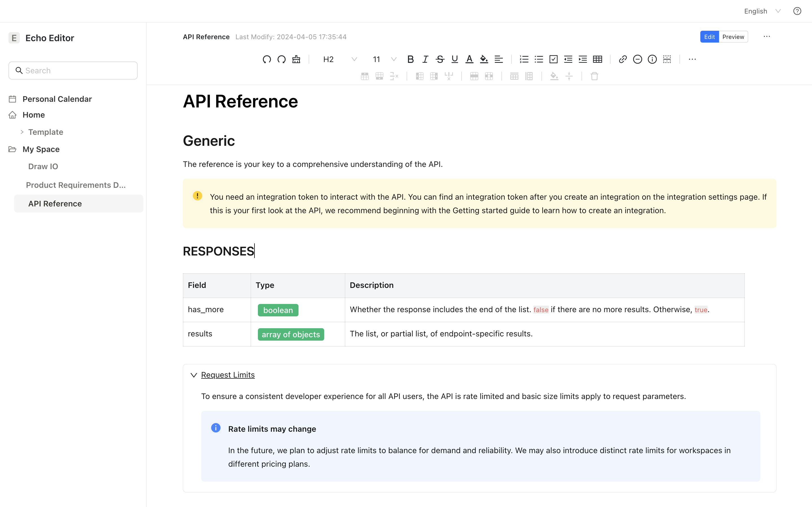
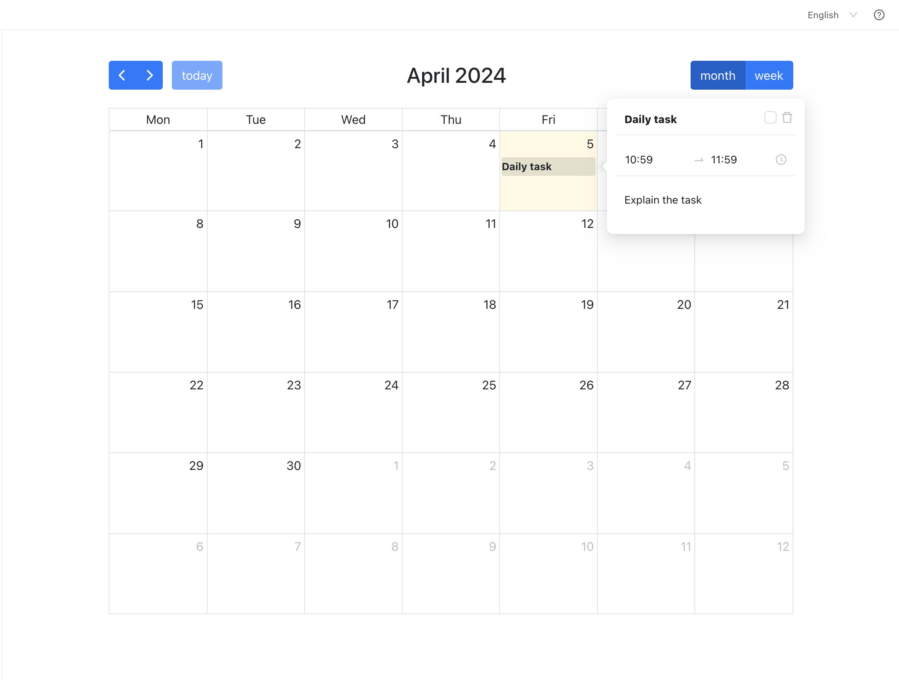
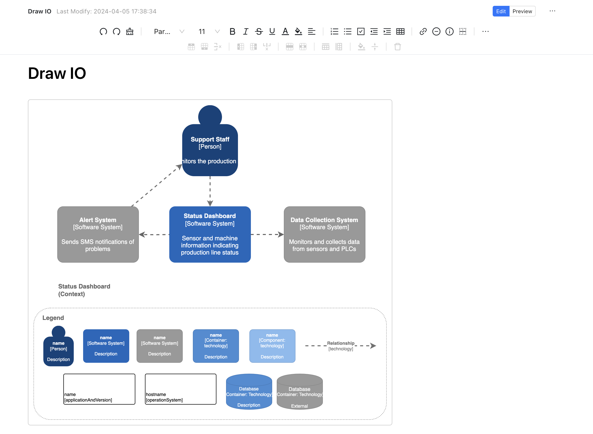
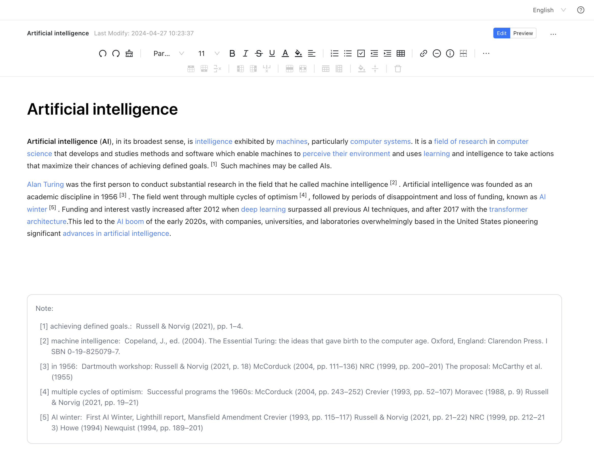
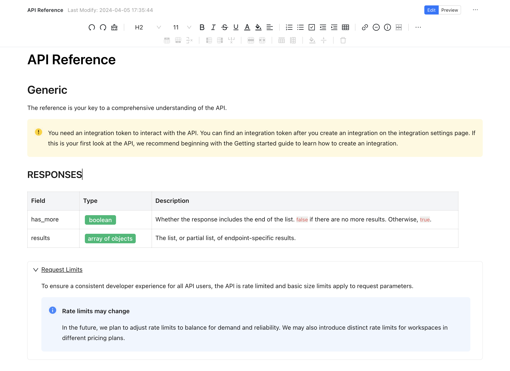

# Echo Editor

Echo Editor is a rich, localized content editor To create the content experience you want.

## Features

### Calendar

Ability to set daily tasks by week and month, and manage tasks such as deletion and completion.

### Draw.io

Draw.io is for making flowcharts, process diagrams, org charts, UML, ER and network diagrams.

### Note

a short explanation or note added to a text or the act of adding short explanations or notes

### Multiple Styles

Can create tables, status, prompt messages, expand and collapse, etc.

### Image

Supports manual uploading, screenshot uploading, and dragging images to shrink.

